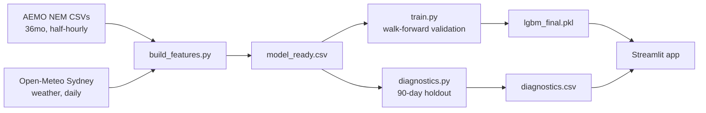

# ⚡ AEMO Grid Demand Forecaster


Short-term electricity demand forecasting for the NSW1 region of Australia's National Electricity Market (NEM), using AEMO's free public price/demand data and Open-Meteo weather history.

**Live demo:** _(add your Streamlit Cloud URL after deploying)_

## Business context
Grid operators and energy retailers need accurate short-term demand forecasts for dispatch planning, price-risk management, and renewable integration. This project builds a daily demand forecaster, validates it honestly against classical time-series baselines, and explores the seasonal, intraday, and price-demand dynamics that drive NEM load.

## Results

| Validation | MAPE |
|---|---|
| **LightGBM — 5-fold walk-forward** | **3.24%** |
| **LightGBM — clean 90-day holdout** | **2.47%** |
| ETS (Holt-Winters) — 5-fold walk-forward | 11.42% |
| Naive (lag-7) — 5-fold walk-forward | 8.81% |

## App
8 tabs: History & Forecast · Seasonal Patterns (monthly boxplot, day-of-week × month heatmap) · Intraday Profile (half-hourly weekday/weekend load shape) · Load Duration Curve & Peaks · Price & Demand (negative-price and spike-price analysis) · Correlations & Diagnostics (feature correlation heatmap, actual-vs-predicted, residuals) · Model Comparison · What-If Simulator.

## Architecture



## Data
- **AEMO NEM Aggregated Price & Demand data** — free, no API key. `https://aemo.com.au/aemo/data/nem/priceanddemand/PRICE_AND_DEMAND_YYYYMM_NSW1.csv`
- **Open-Meteo Historical Weather API** — free, no API key. Sydney daily max/min/mean temp, precipitation, wind.

## Features
Weather (temp, precipitation, wind), calendar (day-of-week, month, weekend, fixed-date public holidays), lag features (demand lag-1/lag-7, temp lag-1), and heating/cooling degree-days (base 18°C). Same-day price and demand max/min are deliberately excluded from the model feature set as they'd leak into a same-day forecast — they're shown in the app for exploratory analysis only.

## Quickstart
```bash
python -m venv venv
venv\Scripts\Activate.ps1        # Windows
pip install -r requirements.txt
python src/data_ingest.py         # pulls 36mo AEMO NSW1 data
python src/weather_ingest.py      # pulls matching Open-Meteo weather
python src/build_features.py      # builds model_ready.csv
python src/train.py               # walk-forward validation + final model
python src/diagnostics.py         # honest out-of-sample holdout diagnostics
streamlit run app.py
```

## Tech stack
Python · LightGBM · statsmodels (ETS baseline) · Streamlit · Plotly · Open-Meteo API · AEMO NEM data

## Limitations
- Single region (NSW1) — other NEM regions (QLD1/VIC1/SA1/TAS1) not yet modelled
- Fixed-date public holidays only (no state-specific or moveable holidays like Easter)
- 3-year training window — hasn't seen a full extreme-weather outlier cycle
- No automated test suite yet

## Roadmap
- Multi-region model (all 5 NEM regions)
- Prophet as a third comparison baseline
- Proper AU holiday calendar (e.g. `holidays` package)
- Intraday (half-hourly) forecasting granularity
- pytest suite + CI badge
- React/Vite companion webapp (matching the climate-economic-risk-explorer pattern)

## License
MIT