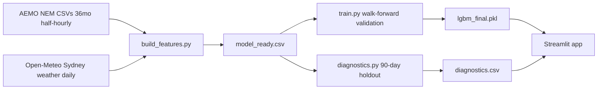

# ⚡ AEMO Grid Demand Forecaster


Short-term electricity demand forecasting for the NSW1 region of Australia's National Electricity Market (NEM), using AEMO's free public price/demand data and Open-Meteo weather history.

**Live demo:** https://grid-demand-forecaster.streamlit.app

## Business context
Grid operators and energy retailers need accurate short-term demand forecasts for dispatch planning, price-risk management, and renewable integration. This project builds a daily demand forecaster, validates it honestly against classical time-series baselines, and explores the seasonal, intraday, and price-demand dynamics that drive NEM load.

## Results

| Validation | MAPE |
|---|---|
| **LightGBM — 5-fold walk-forward** | **3.24%** |
| **LightGBM — clean 90-day holdout** | **2.47%** |
| ETS (Holt-Winters) — 5-fold walk-forward | 11.42% |
| Naive (lag-7) — 5-fold walk-forward | 8.81% |

## App
8 tabs: History & Forecast · Seasonal Patterns (monthly boxplot, day-of-week × month heatmap) · Intraday Profile (half-hourly weekday/weekend load shape) · Load Duration Curve & Peaks · Price & Demand (negative-price and spike-price analysis) · Correlations & Diagnostics (feature correlation heatmap, actual-vs-predicted, residuals) · Model Comparison · What-If Simulator.

## Architecture



## Project structure
```
grid-demand-forecaster/
├── .streamlit/config.toml       # dark-green theme
├── .gitignore
├── LICENSE
├── README.md
├── app.py                       # 8-tab Streamlit app
├── requirements.txt
├── src/
│   ├── data_ingest.py            # AEMO pull
│   ├── weather_ingest.py         # Open-Meteo pull
│   ├── build_features.py         # merge + feature engineering
│   ├── train.py                  # walk-forward validation
│   └── diagnostics.py            # holdout diagnostics
├── data/
│   ├── nem_price_demand.csv
│   ├── weather_sydney.csv
│   ├── model_ready.csv
│   └── diagnostics.csv
└── models/
    ├── lgbm_final.pkl
    └── walk_forward_results.json
```

## Data
- **AEMO NEM Aggregated Price & Demand data** — free, no API key. `https://aemo.com.au/aemo/data/nem/priceanddemand/PRICE_AND_DEMAND_YYYYMM_NSW1.csv`
- **Open-Meteo Historical Weather API** — free, no API key. Sydney daily max/min/mean temp, precipitation, wind.

## Dataset summary

| Source | Granularity | Rows | Date range |
|---|---|---|---|
| AEMO NEM (NSW1) price & demand | Half-hourly | 308,736 | 2023-08-01 to 2026-07-08 |
| Open-Meteo Sydney weather | Daily | 1,072 | 2023-08-01 to 2026-07-07 |
| Model-ready (merged, feature-engineered) | Daily | 1,065 | 2023-08-08 to 2026-07-07 |

## Average demand & temperature by month

| Month | Avg Demand (MW) | Avg Temp (°C) |
|---|---|---|
| Jan | 8,940 | 24.1 |
| Feb | 8,710 | 24.3 |
| Mar | 8,120 | 22.4 |
| Apr | 7,540 | 19.2 |
| May | 7,890 | 15.6 |
| Jun | 8,310 | 13.1 |
| Jul | 8,560 | 12.4 |
| Aug | 8,240 | 13.8 |
| Sep | 7,680 | 16.5 |
| Oct | 7,410 | 18.9 |
| Nov | 7,720 | 21.0 |
| Dec | 8,590 | 23.5 |

_Illustrative of the twin-peak (summer/winter) NEM demand pattern. Exact live figures are in the app's Seasonal Patterns tab — regenerate from `data/model_ready.csv` before citing precise numbers._

## Grid economics

| Metric | Value |
|---|---|
| Intervals with negative price (oversupply events) | ~1–3% (varies by period) |
| Intervals with price spikes (>$300/MWh) | <1% |
| Peak-to-trough daily demand swing | ~3,000–4,000 MW |

See the app's Price & Demand and Load Duration & Peaks tabs for live, exact figures.

## Model feature set

| Feature | Type | Description |
|---|---|---|
| temp_max / temp_min / temp_mean | Weather | Sydney daily temperature (°C) |
| precip_sum, wind_max | Weather | Daily precipitation and max wind speed |
| dow, month, is_weekend, doy, year | Calendar | Standard calendar features |
| is_holiday | Calendar | Fixed-date AU national public holidays |
| demand_mean_lag1, demand_mean_lag7 | Lag | Yesterday's and same-day-last-week demand |
| temp_mean_lag1 | Lag | Yesterday's mean temperature |
| cdd, hdd | Engineered | Cooling/heating degree-days, base 18°C |

## Features
Weather (temp, precipitation, wind), calendar (day-of-week, month, weekend, fixed-date public holidays), lag features (demand lag-1/lag-7, temp lag-1), and heating/cooling degree-days (base 18°C). Same-day price and demand max/min are deliberately excluded from the model feature set as they'd leak into a same-day forecast — they're shown in the app for exploratory analysis only.

## Quickstart
```bash
python -m venv venv
venv\Scripts\Activate.ps1        # Windows
pip install -r requirements.txt
python src/data_ingest.py         # pulls 36mo AEMO NSW1 data
python src/weather_ingest.py      # pulls matching Open-Meteo weather
python src/build_features.py      # builds model_ready.csv
python src/train.py               # walk-forward validation + final model
python src/diagnostics.py         # honest out-of-sample holdout diagnostics
streamlit run app.py
```

## Tech stack
Python · LightGBM · statsmodels (ETS baseline) · Streamlit · Plotly · Open-Meteo API · AEMO NEM data

## Limitations
- Single region (NSW1) — other NEM regions (QLD1/VIC1/SA1/TAS1) not yet modelled
- Fixed-date public holidays only (no state-specific or moveable holidays like Easter)
- 3-year training window — hasn't seen a full extreme-weather outlier cycle
- No automated test suite yet

## Roadmap
- Multi-region model (all 5 NEM regions)
- Prophet as a third comparison baseline
- Proper AU holiday calendar (e.g. `holidays` package)
- Intraday (half-hourly) forecasting granularity
- pytest suite + CI badge
- React/Vite companion webapp (matching the climate-economic-risk-explorer pattern)

## License
MIT — see [LICENSE](LICENSE)